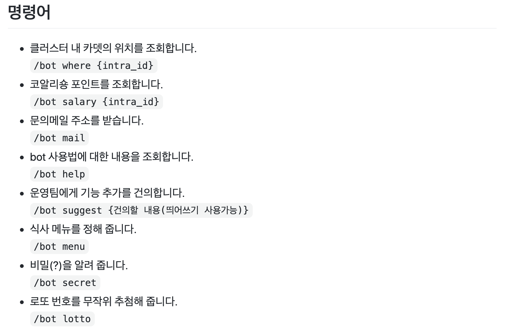

# 불편한 건 못참지! 나와라 슬랙봇! (42vin 팀)

- 안녕하세요, 저희는 42vin 팀입니다!
## 슬랙봇 개발의 서막
- 바야흐로 4주 전.. 허광남 멘토님의 지도아래 슬랙봇을 뚝딱뚝딱 만들 팀이 구성되습니다..!

- 저번 달 저희 42vin 팀은 슬랙봇을 어떻게 부려먹을까 기대하며 slabs-slackbot에 지원했습니다.
    1. 다른 카뎃은 어디 있을까? (평가 직전 유용할 것으로 추정)[완성]
    2. 내가 지원금을 받을 수 있을까? [완성]
    3. 등록된 과제로부터 몇일이 지났을까? [미완성]
    4. 기타 등등...
- 과제는 위와 같이 3주안에 저희가 원했던 기능을 목표로, 매주 2회 멘토님과 회의를 하고 부족한 부분을 공부해나가는 방식으로 진행되었습니다.
- 지금부터 3주간에 과정과 구현 과정과, 고민한 부분에 대해 적어보겠습니다!
> 슬랙봇 개발, 세상을 바꿀 수 있을지도(?)  
> : [토스의 슬랙봇 설계](https://www.youtube.com/watch?v=EChKnpxgX-4) 카뎃을 서포트하는 42vin을 만들자만들자!

## 뚝딱뚝딱 로봇과 소통하기
### 뚝딱뚝딱 로봇 귀 만들기
- 슬랙 봇에는 아래와 같은 기능들이 있습니다.

- 저희가 가장 먼저 사용한 슬랙봇의 기능은 Webhook 방식입니다.
- Webhook 방식은 URL만을 가지고 slack에 메세지를 전송할 수 있는 기능입니다.  
    https://api.slack.com/tutorials/slack-apps-hello-world
- 하지만, 일방적으로 사용자에게 메세지를 전송하는 것보다, 소통할 수 있는 로봇이 필요합니다!

### 뚝딱뚝딱 로봇과 커뮤니케이션하기 (Event Subsciption)
- 따라서, 우리는 Event Subscriptions, Slash Commands 기능을 사용해야합니다!
- **Event Subscriptions**는 채팅창에 입력된 단어에 대한 응답을 주는 방식입니다.
 
[참고: slabs-slackbot 위키](https://github.com/innovationacademy-kr/slabs-slackbot/wiki/Event-Subscriptions#event-subscriptions)
### 뚝딱뚝딱 로봇과 커뮤니케이션하기 (Slash Commands)
- Event Subscription 방식은 사용자 입장에서는 편리하지만, 채팅을 치다가 로봇이 갑툭튀(?)하는 경우도 있을 수도 있기 때문에!
- 따라서, 저희는 주로 **Slash Commands** 위주로 개발을 시작했습니다!

## 뚝딱뚝딱 로봇의 뇌 만들기 (42 API 사용하기)
- API 사용법은 멘토님께서 innovationacademy 깃에 공유해주신 42Seoul-info 레파지토리를 보며 공부했습니다!  
  [innovationacademy-kr/42Seoul-info](https://github.com/innovationacademy-kr/42seoul-info)
- 처음에는 위 예제만 보고 passport.js를 이용하여 OAuth2.0을 사용하려고 했지만, 로그인 후에 Authorize 버튼을 눌러야지만 토큰을 받아올 수 있다는 문제가 생겼습니다..
- 토큰을 받을 때마다 로그인을 해야하나 고민하며, **jaeskim**님에게 다짜고짜 찾아가서 방법을 물었습니다.
- client credential 모드를 써라!는 얘기를 듣고, 다른 모듈을 찾아봤습니다! 바로바로!! 
- 'axios'모듈과 'axios-oauth-client'모듈입니다!(사용법은 npm에서 찾아보시면 좋을 거 같아요!)
- client credential 모드로 토큰을 받고난 후 부터는 원하는 명령어를 촤자작 붙여나갈 수 있다는 자신감이 생겼습니다!

## 현재까지 구현된 기능
- Slash Commands를 이용해서 아래와 같은 기능들을 사용할 수 있습니다!

[참고: slabs-slack 깃](https://github.com/innovationacademy-kr/slabs-slackbot)
## 우리함께 슬랙봇의 뇌를 채워보아요
- 저희는 로봇을 만들었고, 이제 여러분과 함께 슬랙봇의 빈 뇌를 채워가야합니다.
- 현재 계획하고 있는 기능들은 아래와 같고, 생각날 때마다 위키에 추가할 예정입니다.
- github의 Actions와 jest를 공부하여, 푸쉬 후에 테스트와 배포까지 자동화할 예정입니다.
- `/bot suggest {건의할 내용(띄어쓰기 사용가능)}`을 통해 어떤 기능을 추가해달라고 얘기해주시면, 틈나는대로 추가해하겠습니다!
- 추후에 모든 카뎃분들이 contribute하실 수 있도록 템플릿에 만들 예정입니다! 
- 템플릿에 맞추어 Pull requests를 해주시면 merge 하겠습니다!